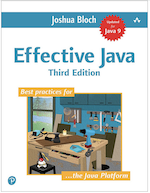
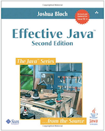
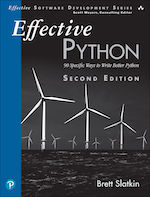

> These are a set of commonalities and practices learn from my experience with Java, Python and Javascript development over near 20 years of experience. Angel Lacret
    
This set of practices are heavily based on these books:

For Java:

|   | [Effective Java](https://www.amazon.com/gp/product/0134685997/ref=as_li_tl?ie=UTF8&tag=gurupia-20&camp=1789&creative=9325&linkCode=as2&creativeASIN=0134685997&linkId=4e66ae1154a5d6dab6b03394fcfee40b)|
|---|---|
|   | [Effective Java 2](https://www.amazon.com/gp/product/B078H61SCH/ref=as_li_tl?ie=UTF8&tag=gurupia-20&camp=1789&creative=9325&linkCode=as2&creativeASIN=B078H61SCH&linkId=b950edc2c1bec33e7e14acd66e569504)|

For Python:

|   | [Effective Python](https://www.amazon.com/gp/product/0134853989/ref=as_li_tl?ie=UTF8&tag=gurupia-20&camp=1789&creative=9325&linkCode=as2&creativeASIN=0134853989&linkId=2c2867868bcdab4bb2ee21b4cdd6b133)|
|---|---|

This document aims to reduce the friction between patterns, conventions and best practices to right `effective code`. (See below)

### **Effective code:**

- Easy to understand
- Well organized
- Self descriptive
- Well documented
- Easily Testable
- Easily Debuggable
- Named under a clear pattern
- Robust: enhancements don't create undesired side effects
- Portable: easy to reuse
- Predictable
- [SOLID](https://en.wikipedia.org/wiki/SOLID) compliant

### as the contrast of **Ineffective Code:**

- Difficult to understand and read
- Difficult to test
- Difficult to debug: Given a fail scenario is not clear to the eye where the error is being generated
- Does more than 1 thing


# **1. General Best Practices for Code Style.**

<br/>

## **1.1 Don't use more than one sentence in a try/catch block**

Is a common mistake for new developers to surround long function calls or views inside try-catch blocks as a failsafe or catch all exception handling. But in fact, this is one sign of ineffective code.

Multi sentence try catch blocks are **ineffective** because:

- Difficult to debug, as is not 100% clear which sentences are generating an exception.
- Promote a bad pattern of handling all exceptions in the same way
- Usually this broad catch blocks make use of a generic and catch all object or class that does not prepare your code for unknown / undesired scenarios, and promotes the handling of all the exceptions in the same way. 

Keep your code predictable, robust, solid and **effective** by:

- For readability and robustness keep your try/catch blocks limited to 1 sentence
- Use specific Exceptions subclasses and not broads classes or definitions to prevent unknown scenarios to behave like know scenarios
- For easier bug hunting, make sure to handle different Exceptional scenarios appropriately  


<br/>
## **1.2 Prefer the use of `constants` over `variables`.**

Prefer the use of `constants` over `variables` for holding values always that is possible.

- The use of constants reduces the occurrences of bugs by reducing the origins of errors like: assignments, loops, contexts, etc.
- Code readability, constants values by definition cannot change, making the code easier to read and to debug.
- Efficiency: Many Runtimes promise faster access to constant values than to variables values.


<br/>

## **1.3 Prefer use the **Return Early** pattern instead of complex conditionals or nested blocks** 

Enforce the **Return Early** pattern in functions and methods.

- Return early pattern forces you to first consider exceptional situations or error conditions in your functions like validations and variables or input inconsistencies on the first lines of a function or method.
- Reduce Visual Noise
- Reduce complexity of conditionals
- Increase readability by excluding error and edge conditions early on the code and letting focusing on the complex part of the function


*PREFER THIS:*

```python
def is_valid_string (text, allow_empty = false):
	if text === None: 
		return False
	if text === '' and allow_empty == False: 
		return False
	return True
);
```

```javascript
const isDivisibleBy = (value, divisor) => (
	if(value === 0) 
		return true;
	if(divisor === 0) 
		return false;
	if(value === divisor) 
		return true;
	return value % divisor === 0;
);

const TableView = ({children, loading}) => {
	if(loading)
		return <Loading size={10} />;

	//... logic
	return (
	    <div className='inline-block'>
	        <h1 className='header-note'>
	            {children}
	            <span class='icon-header-note'>
	                
	            </span> 
	        </h1>
	    </div>
	);
}
```

*AND NOT THIS:*

```python
def is_valid_string (text, allow_empty = false):
	if text !== None :
        #
        #
            if ...
                #
                #
                #
                return True
    else:
	    return False
);

```

```javascript
const isValidString = (text, allowEmpty = false) => (
	if(text !== null){
		if(text !== undefined){
			if(allowEmpty === false){
				if (text === ''){
					return false;
				}else{
					return true
				}					
			}
			else...
		}
	}else{
		return false;
	}
);

const TableView = ({children, loading}) => {
	//	... logic
	return (
		{loading ? <Loading size={10}> :
	    <div className='inline-block'>
	        <h1 className='header-note'>
	            {children}
	            <span class='icon-header-note'>
	                
	            </span> 
	        </h1>
	    </div>}
	);
}
```

## 1.4 Manage errors and exceptional situations with Exceptions 

 
- Meaningful values like false or null or None or void do not represent properly an error scenario.
- Raising exceptions allows you to be consistent with the result type of the function.
- Allows the user of the function what to do on each scenario.
- Avoids confusion comparing return values.


# 2. Code Review:

Code Review should be a practice used by all development teams as is probed technique that, done right improves the **effectiveness** of any code base.

In Cobuild Lab, we use this technique as a mandatory step before merging any feature into a collaboration branch. 

Code reviews in Cobuild Lab is being based mainly in the process used by Google Engineers and posted on [Github](https://google.github.com) and the [Git Feature Branch Flow](https://www.atlassian.com/git/tutorials/comparing-workflows/feature-branch-workflow) proposed by [Atlassian]:

- [Git Feature Branch Flow](https://www.atlassian.com/git/tutorials/comparing-workflows/feature-branch-workflow)
- [The Standard of Code Review](https://google.github.io/eng-practices/review/reviewer/standard.html)
 
Here, we present a brief summary of the aspects of a good process of Code Review:

## Principles

- The main goal of the Code Reviewing process is to increase the quality of the code base of any given project.
- The Code Review can be used as a Learning Process as is a good tool to communicate the best practices and solutions to code owners.  
- The reviewer has ownership over the code being reviewed thus is responsible for its quality as well. 
- Secondary goals of the Code Review process are:
    * Keep consistency in the code across the organization
    * Detect defects before any merge event
    * Identify common patterns that can be added to the Knowledge base of the organization (Conventions documents)
    * Prevent unnecessary additions to the projects code base.
- Comments on review should carry a proper explanation and alternative solution (if any)
- Any conflicts that can't be agreed between author and reviewer needs to be escalated. 


## Preparing your code for reviewing:

Before submitting your code for reviewing make sure to read and follow these conventions:

- [Feature Branch Strategy](https://www.atlassian.com/git/tutorials/comparing-workflows/feature-branch-workflow)
- [Git Branches strategy for environments on web applications](https://www.devsup.io/git-branches-strategy-for-environment-deployment-on-web-applications/)
- [Effective Programming](https://www.devsup.io/effective-programming-at-cobuildlab/) (This guide)
- [Conventions to create a React or React Native Application](https://www.devsup.io/conventions-to-create-a-react-application/)
- [Conventions for Javascript / Typescript source code](https://www.devsup.io/conventions-for-javascript-typescript-source-code/)

In addition to this, make sure you provide the proper information and compliant with the following requirements:

- Describe the work done
- Issues that solves when merged (e.x: solves #456)
- User Story compliant: Make sure that your Code solves the requirements of the Use Case, ticket or issue.
- Make sure your coode follows the style guidelines of the organization
- You have performed a self-review of your code
- The code is properly documented as the specification in the conventions documents.
- You have made corresponding changes to the documentation of the project
- Your changes do not introduce any new warnings
- You have added the proper tests to the features included
- New and existing unit tests pass locally with the updates
- Provide instructions to Validate the Features has been, screenshots if necessary
- Indicate any new constraint or side effect


## General Rules

- Follow organization conventions
- > Technical facts and data overrule opinions and personal preferences.
  > Aspects of software design are almost never a pure style issue or just a personal preference. They are based on underlying principles and should be weighed on those principles, not simply by personal opinion. Sometimes there are a few valid options. If the author can demonstrate (either through data or based on solid engineering principles) that several approaches are equally valid, then the reviewer should accept the preference of the author. Otherwise the choice is dictated by standard principles of software design.
  > If no other rule applies, then the reviewer may ask the author to be consistent with what is in the current codebase, as long as that doesn’t worsen the overall code health of the system.
- Make sure review every single line of code

## What to look in a Code Review?

- Does the features and changes make sense?
- The use of common agreed patterns
- The use of Anti Patterns or bad practices
- Unnecessary complexity
- Opportunities to contribute to the libraries maintained by the organization or to create new ones:
    * [React Typescript App Starter](https://github.com/cobuildlab/create-react-typescript-app)
    * [React Native Typescript App Starter](https://github.com/cobuildlab/create-react-native-typescript-app)
    * [React NodeJS Typescript App Starter](https://github.com/cobuildlab/create-nodejs-app)
    * [React State Library](https://github.com/cobuildlab/react-simple-state)
    * [Validation Utils](https://github.com/cobuildlab/validation-utils)
    * [Hooks utils](https://github.com/cobuildlab/hooks-utils)
    * [Stripe Utils](https://github.com/cobuildlab/stripe-utils)
    * [8base-utils](https://github.com/cobuildlab/8base-utils)
    * [Logging library](https://github.com/cobuildlab/pure-logger)
 - Avoid code duplicity
 - Test are reasonably extensive
    
