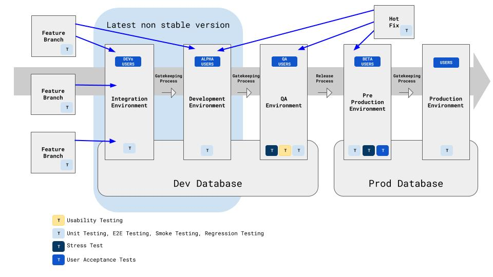

Here we show a proposed approach for managing deployment environments using Git branches, and how the flow of the code for these branches should flow and be conditioned.

This diagram is being base on our experience developing web applications, and the [Feature Branch](https://www.atlassian.com/git/tutorials/comparing-workflows/feature-branch-workflow) Approach proposed by Atlassian. 
 

# General considerations:

- Every environment should have automated E2E tests, Regression Tests, and Unit Tests.
- Every Branch/Environment should have a gate keeper process, policy or person.
- Feature Branches start from the left and are promoted to the right by the gate keeping processes, policies or people.
- Hot Fixes branches start from the environment where they were identified and move to the left to update the previous environments.

# Branches / Environments:

## Feature Branch

Feature branches are branches exclusively to work on new features or enhancements to the stable version of the system. 

Normally but not always these branches should be created from the Production branch and its integration process should start at the `Integration Environment`.  

## Hot Fix Branch

Hot fixes branches are created to fix or repair non planned issues or bugs. They are created from the far mor right branch where they were identified.

Once completed and integrated in the environment where they were initially required, they need to be integrated in previous environments. 

## Integration Environment

The integration environment is branch where features are tested primarily for Regression Problems before they are promoted to the Development Environment.

This may be an environment, or a process or both where a validation is performed to test that the new merged features work properly with other new features.   

## Development Environment

This is the environment where all the new features initially get published. 

Usually called `dev` branch or `master` branch is a physical environment where the developers can see their features under production like circumstances. 

## QA Environment

This is the environment where the QA team can perform functional tests on the new merged features. 

This environment is separate from development with the purpose of being isolated from integration issues. 

## Pre Production Environment

This environment has the latest tested features by the QA team, and can be exposed to real users for approvals or for Beta programs.  

## Production Environment

This is the most stable environment / branch where the pre-production updates get promoted to made publicly available the new features and fixes of the system.
